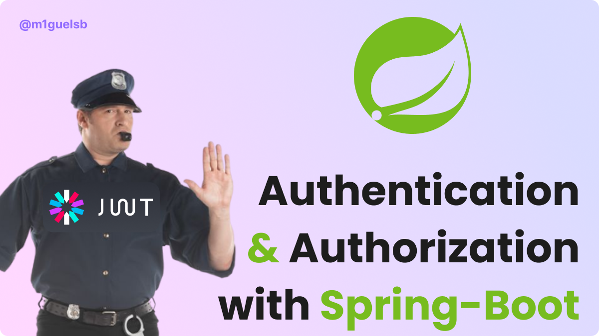

<p align="center">
  <a href="#">
    
  </a>
</p>

<p align="center">
  

  

  
</p>

---

## About 🔍
In this tutorial we learn how to apply protected routes with jwt authentication and authorization in spring.

## Stack 🔧
- Java 17
- Spring-boot 3.1.5
- JWT
- Hibernate/JPA
- PostgreSQL

---

## How to run 🏃

1 - Make sure docker is running and start the database with docker compose:
```bash
$ docker compose up

```
2 - Run the application:
```bash
$ mvn spring-boot:run
```

>Did you find any bug or wanna tell me something?
Let me know in my [Twitter/X](https://x.com/m1guelsb).
